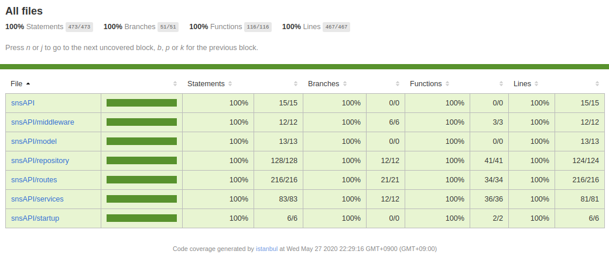

소개: 인스타그램 클론 한 프로젝트의 서버 부분

서버 깃허브 주소: https://github.com/gyim1345/snsAPI

클라이언트 깃허브 주소: https://github.com/gyim1345/sns

서버 사용 주 기술: express, mongodb, mongoose, AWS, jest, supertest

현재 상태: 배포 중단

test 작성 프리뷰
